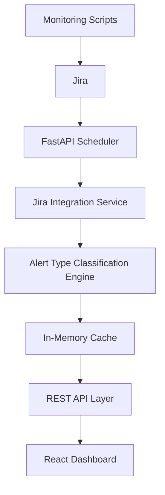

# Architecture

## High-Level Flow



## Backend Structure

```text
backend/
  app/
    api/
      routes.py
    services/
      cache.py
      category_classifier.py
      jira_client.py
    config.py
    main.py
    models.py
  alert_type_rules.json
  requirements.txt
```

## Frontend Structure

```text
frontend/
  src/
    api/
      client.js
    components/
      HierarchyTree.jsx
      MetricCard.jsx
      TicketDetails.jsx
    App.jsx
    main.jsx
    styles.css
```

## Runtime Behavior

- FastAPI starts an APScheduler job.
- The scheduler refreshes Jira data every 5 minutes.
- Jira issues from the last 7 days are fetched.
- The backend derives the last 2 days dataset from the same cached source.
- Tickets are assigned an Alert Type using `alert_type_rules.json`.
- Cache replacement is atomic: a new dataset is built before replacing the old one.
- React never calls Jira directly. It only calls FastAPI.

## Future Extension Points

- Add alert services beside the cache refresh flow.
- Add SLA calculations to the ticket normalization or cache build step.
- Add threshold configuration per cluster_id, clientId Env, or Alert Type.
