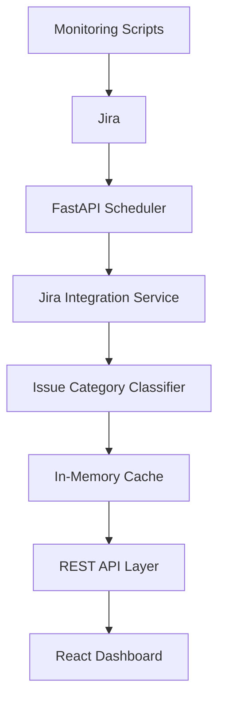

# Architecture

## High-Level Flow



## Backend Structure

```text
backend/
  app/
    api/
      routes.py
    services/
      cache.py
      category_classifier.py
      company_host.py
      diagnostic_service.py
      jira_client.py
    config.py
    main.py
    models.py
  requirements.txt
```

## Frontend Structure

```text
frontend/
  src/
    api/
      client.js
    components/
      DiagnosticModal.jsx
      HierarchyTree.jsx
      MetricCard.jsx
      TicketDetails.jsx
      TicketDetailsPanel.jsx
    App.jsx
    main.jsx
    styles.css
```

## Issue Category Classification

Tickets are grouped by a **dynamic issue category** extracted from each ticket's Jira summary. No static rules file or code change is required when new issue types appear.

Examples:

| Summary | Extracted category |
|---------|-------------------|
| `CL17 - PRD - AZ - Stuck UploadFile - Files in IN folder stuck...` | `Stuck UploadFile` |
| `CVS: PP: Cognos Schdule Extracts files not found` | `Cognos Schdule Extracts files not found` |

Classification logic lives in `backend/app/services/category_classifier.py` and handles common WAPM summary patterns:

- **Cluster dash format** — `CL## - ENV - REGION - IssueName - details...` → category is the issue name segment.
- **Colon env format** — `CLIENT: ENV: Issue description` → category is the description after the env prefix.
- **Other dash formats** — falls back to the most meaningful dash-separated segment.
- **Unrecognized format** — uses the full summary as the category label.

Each ticket still retains `cluster_id` and `clientId Env` metadata from Jira custom fields for search and the details panel, but the hierarchy tree groups only by issue category.

## Runtime Behavior

- FastAPI starts an APScheduler job.
- The scheduler refreshes Jira data every 5 minutes.
- Jira issues from the last 7 days are fetched.
- The backend derives the last 2 days dataset from the same cached source.
- Each ticket is assigned an issue category during cache normalization.
- The hierarchy is built as: **Issue Category → Tickets**.
- Cache replacement is atomic: a new dataset is built before replacing the old one.
- React never calls Jira directly. It only calls FastAPI.

## Frontend Layout

- **Control panel** — date filter (2 or 7 days), search, manual refresh, cache status.
- **Metrics row** — total tickets, status counts, issue category count, last refresh.
- **Ticket list** — expandable tree grouped by issue category, or flat search results.
- **Details drawer** — hidden by default; slides in from the right when a ticket is selected. The list panel shrinks with a CSS transition. Close via the X button or backdrop (on smaller screens).
- **Diagnostic modal** — launched from ticket details; runs precheck and OTP-backed diagnostic execution against configured remote hosts.

## Future Extension Points

- Add alert services beside the cache refresh flow.
- Add SLA calculations to the ticket normalization or cache build step.
- Add threshold configuration per issue category, cluster_id, or clientId Env.
